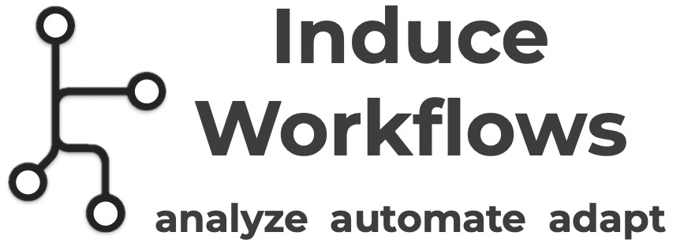

<p align="center">
<picture>
  <source media="(prefers-color-scheme: dark)" srcset="./assets/logo.jpg">
  <source media="(prefers-color-scheme: light)" srcset="./assets/logo.jpg">
  
</picture>
</p>

# Workflow Induction Toolkit

We introduce a scalable toolkit to induce interpretable, structured workflows from either human or agent computer-use activities, usually consisting heterogeneous low-level actions.

<div align="left">
  <a href="https://img.shields.io/badge/arXiv-251x.xxxxx-b31b1b.svg">
    
  </a>
</div>

## Quick Start 🚀

```bash
bash induce_workflow.sh ${DATA_DIR}  # "~/Downloads/records" by default
```
Find workflow step descriptions in `${DATA_DIR}/workflow.txt` and detailed data in `${DATA_DIR}/workflow.json`.

## ① Installation
```bash
git clone https://github.com/zorazrw/workflow-induction-toolkit
cd workflow-induction-toolkit
export OPENAI_API_KEY=${YOUR_API_KEY}
```

## ② Record Human Computer-Use Activities

Install the recording tool:
```bash
cd computer-recorder
pip install -e .
```

Enable recording permission on your Mac: go to System Preferences $\rightarrow$ Privacy & Security $\rightarrow$ Accessibility, allow recording for the app that you use to edit the code, e.g., VSCode.
Then follow the [instructions](computer-recorder/instructions.pdf) to configure the system settings.

Run the recording tool by simply running:
```bash
crec   # Press `Ctrl+C` to stop the recording.
```


## ③ Induce Human Workflows

```bash
cd workflow-induction
pip install -r requirements.txt
```

To parse a human trajectory, we first need to merge duplicate actions:
```bash
python get_human_trajectory.py --data_dir <data_dir>
```
where `data_dir` should be directory containing the `records`, e.g., `~/Downloads/` by default.

Then, segment the trajectory based on state transitions:
```bash
python segment.py --data_dir <data_dir>
```

Lastly, perform semantic-based segment merging:
```bash
python induce.py --data_dir <data_dir> --auto
```
where `--auto` is used to automatically iterate and terminate workflow induction.

The workflow will be saved in the `{data_dir}/workflow.json` as a JSON file.
The high-level step description will be saved in the `{data_dir}/workflow.txt` as plain texts.

## Acknowledgement

Please cite our paper if you find this toolkit useful in your research:

```bibtex
@inproceedings{xxx2025wang,
  title = {How AI Agents Do Human Work? Comparing AI and Human Workflows Across Diverse Occupations},
  author = {Wang, Zora Zhiruo and Last, First},
  journal={arXiv preprint arXiv:251x.xxxxx},
  year = {2025},
}
```

The recording tool is built upon [GUM](https://github.com/generalusermodels/gum).
